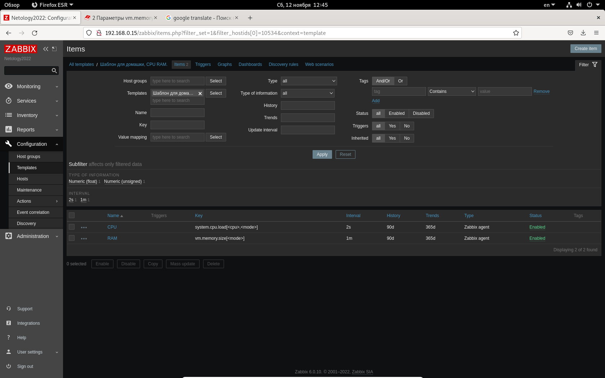
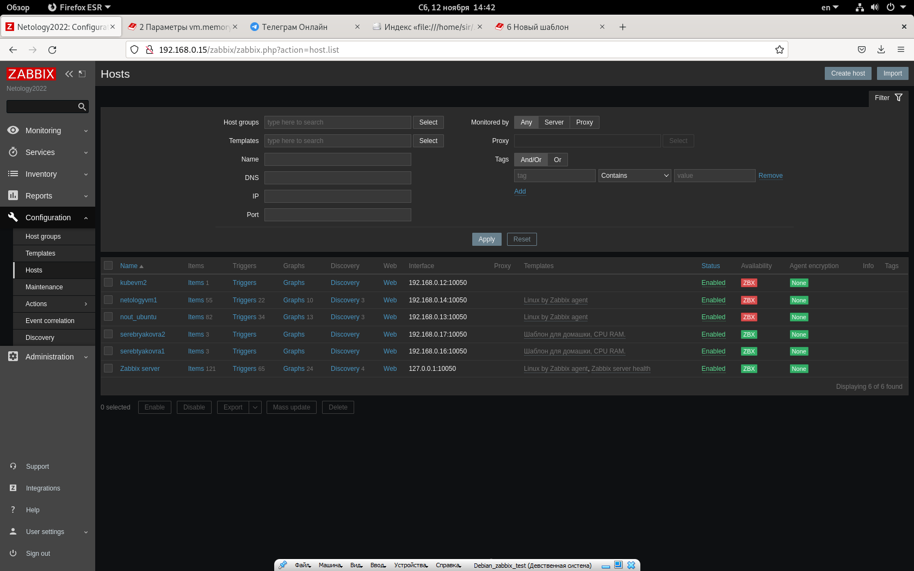
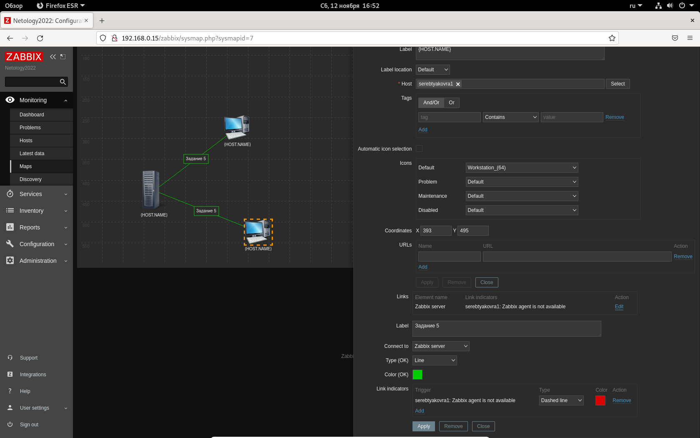
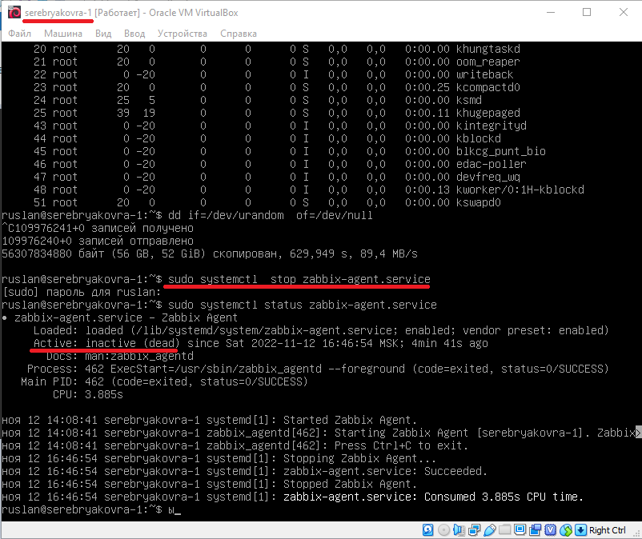
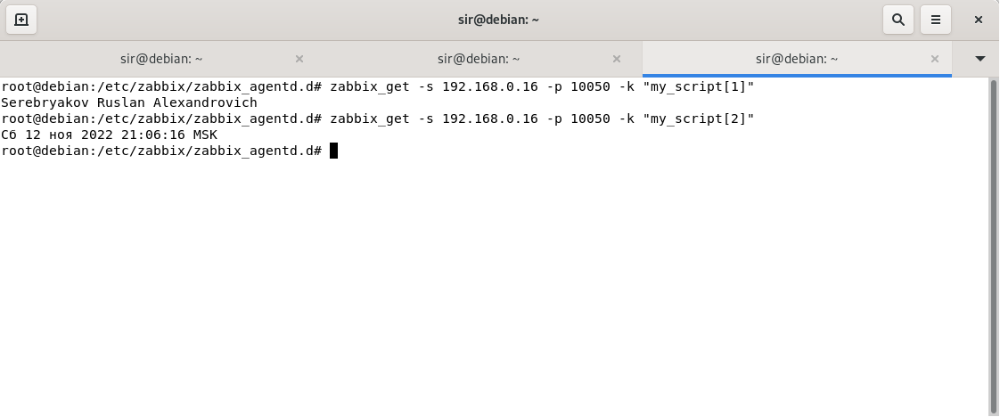
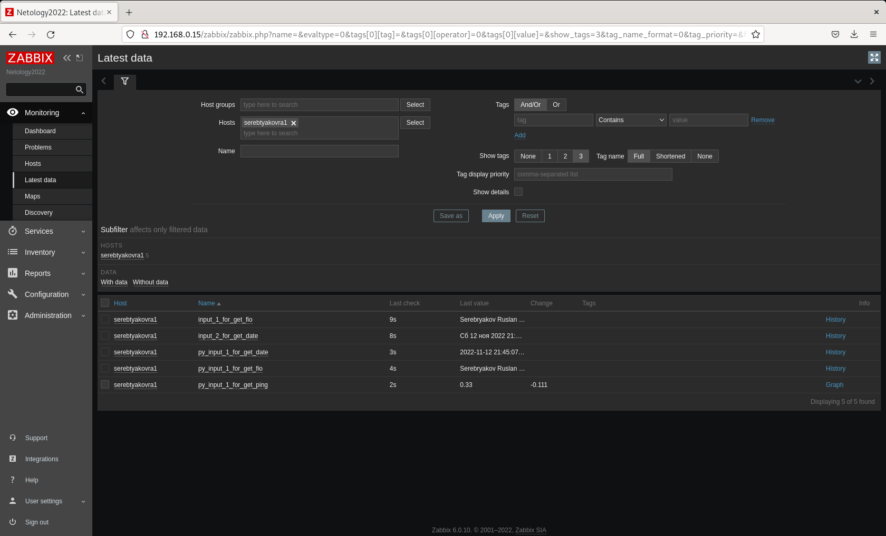
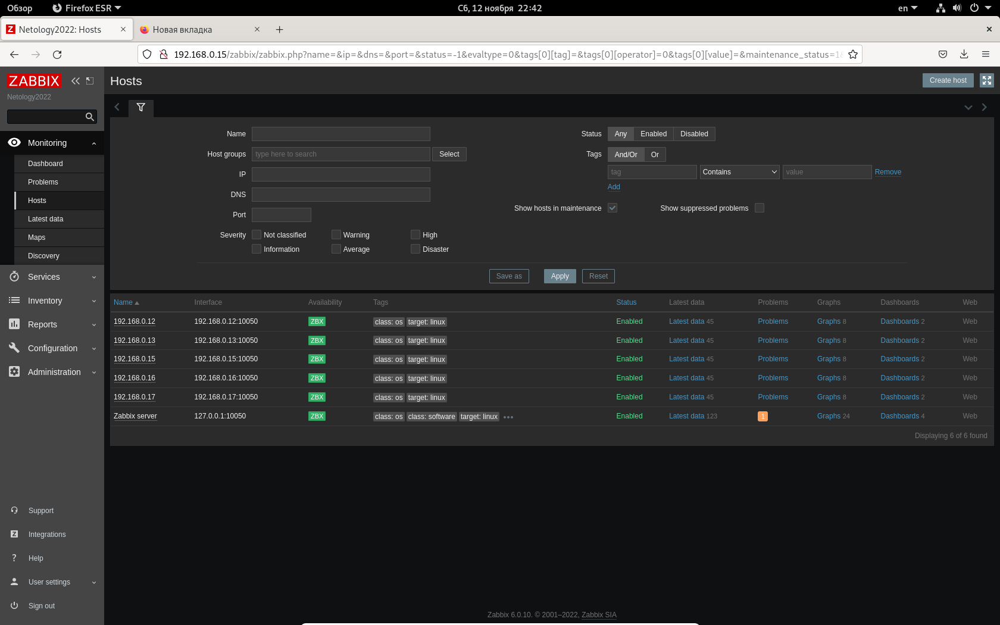
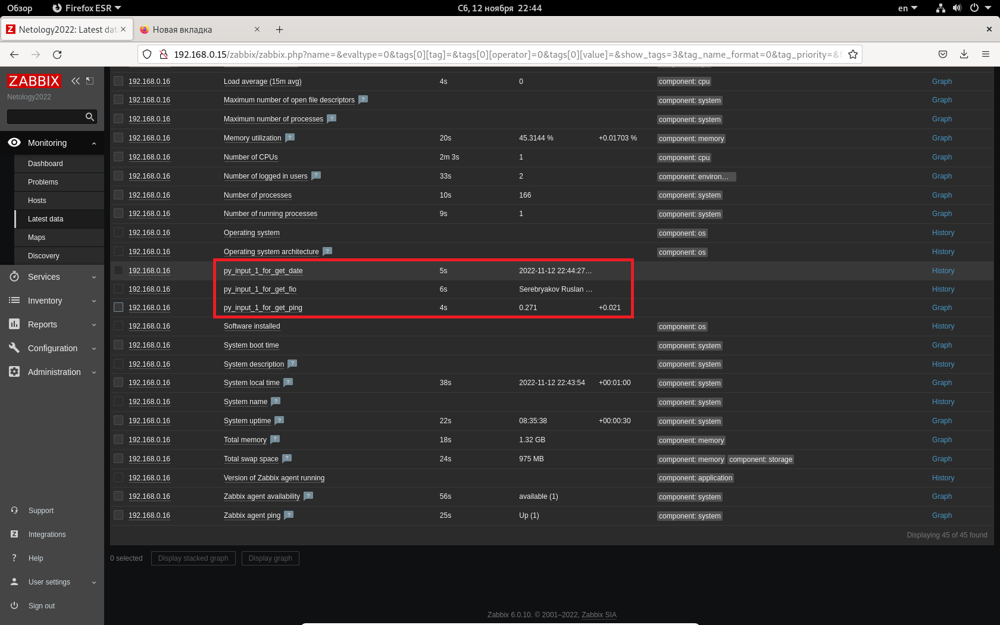

# Домашнее задание к занятию "``9.3. Система мониторинга Zabbix. Часть 2" - `Серебряков Руслан`

### Задание 1

Создайте свой шаблон, в котором будут элементы данных, мониторящие загрузку CPU и RAM хоста.

Сохраните в Git скриншот страницы шаблона с названием “Задание 1”
---
Только после того, как я сделал всю работу(кроме 9-го задания), я увидел что название не соответствует. Но я думаю это мелочь :^)

---
---

### Задание 2

Добавьте в Zabbix два хоста и задайте им имена <фамилия и инициалы-1> и <фамилия и инициалы-2>. Пример: ivanovii-1 и ivanovii-2

Результат данного задания сдавайте вместе с Заданием 3
---
ok
---
---

### Задание 3

Привяжите созданный вами шаблон к двум хостам. Так же привяжите к обоим хостам шаблон Linux by Zabbix Agent.

Сохраните в Git скриншот страницы хостов где будут видны привязки шаблонов с названием “Задание 2-3”. Хосты должны иметь зелёный статус подключения
---
`
---
---

### Задание 4

Создайте свой кастомный дашборд

Сохраните в Git скриншот дашборда с названием “Задание 4”
---

`

---
---

## Дополнительные задания (со звездочкой*)

### Задание 5*

Создайте карту расположите на ней два своих хоста:

Настройте между хостами линк
Привяжите к линку триггер связанный с agent.ping одного из хостов и установите индикатором сработки триггера - красную пунктирную линию
Выключьте хост чей триггер добавлен в линк. Дождитесь сработки триггера.
* Сохраните в Git скриншот карты где видна сработка триггера с названием “Задание 5”*
---

`
`
Кстати, сначала я думал, что ничего не работает, начал копать в интернете, а потом увидел, что там должно пройти 3 минуты =)
`
---
---

### Задание 6*

Создайте UserParameter на bash и прикрепите его к созданному вами ранее шаблону. Он должен вызывать какой-нибудь скрипт, который:

при получении 1 будет возвращать ваши ФИО,
при получении 2, будет возвращать текущую дату.
Приложите код скрипта в Git. Приложите в Git скриншот Latest data с результатом работы скрипта на bash, чтобы был виден результат работы скрипта при отправке в него 1 и результат работы скрипта при отправке в него 2.

---

`
`
`
---
---

### Задание 7*

Доработайте Python скрипт из лекции, создайте для него UserParameter и прикрепите его к созданному вами ранее шаблону. Скрипт должен:

при получении 1 будет возвращать ваши ФИО,
при получении 2, будет возвращать текущую дату.
делать всё то что делал скрипт из лекции
Приложите код скрипта в Git. Приложите в Git скриншот Latest data с результатом работы скрипта на python, чтобы были видны результаты работы скрипта при отправке в него 1, 2, -ping, а также -simple_print.
---

---
---

### Задание 8*

Настройте автообнаружение и прикрепление к хостам созданного вами ранее шаблона.

Приложите в Git скриншот правила обнаружения. Приложите в Git скриншот страницы Discover где видны оба хоста.
---

---
---

